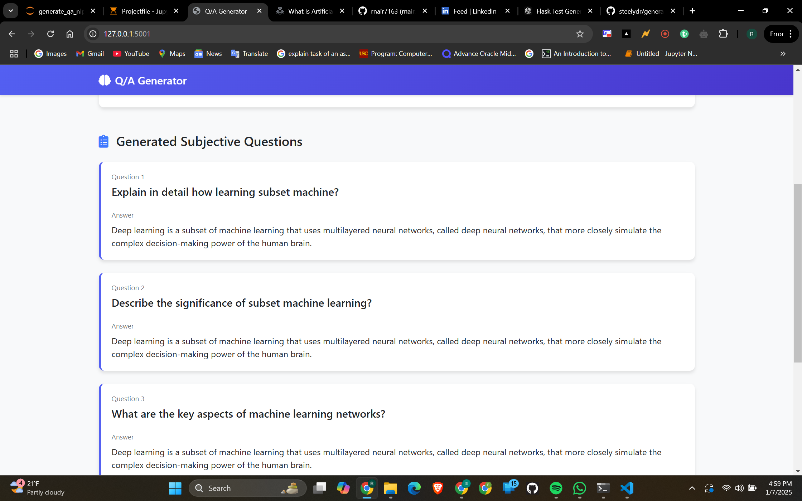

<video controls src="QandAgeneratorf.mp4" title="Title"></video>

---
"NLTK Usage in Flask Test Generator"
---

## 1. Sentence Tokenization and Parsing

The application starts by using NLTK's powerful sentence tokenizer to break the input text into individual sentences. This step is crucial for managing large paragraphs and handling them sentence by sentence, allowing for targeted analysis and question generation. By tokenizing the text, the code ensures that each sentence can be separately processed, which lays the foundation for effective NLP-driven question creation.

## 2. Part-of-Speech Tagging

Once the text is split into sentences, NLTK’s part-of-speech (POS) tagging comes into play. The code applies POS tagging on the words within each sentence to identify nouns, proper nouns, and other significant word types. This tagging is fundamental for the subjective question generation, as it helps pinpoint key concepts and entities in the text that are essential for forming meaningful questions and extracting accurate answers.

## 3. Chunking with Regular Expressions

For objective question generation, the code leverages NLTK's chunking capabilities using a predefined grammar. This process groups words into phrases (chunks) based on their parts of speech, using patterns that focus on noun phrases and other structures. By creating a parse tree with these chunks, the application can identify significant phrases within sentences that serve as the basis for fill-in-the-blank questions, showcasing advanced NLP techniques in action.

## 4. Semantic Analysis with WordNet

NLTK’s integration with WordNet—a large lexical database of English—is vital for creating realistic distractors in objective questions. After identifying a phrase to blank out, the code queries WordNet for synonyms, hyponyms, and related words. This semantic analysis ensures that the distractors provided are contextually relevant and plausible, enhancing the quality of the multiple-choice options generated by the application.

## 5. Integration and Overall NLP Flow

Throughout the application, NLTK serves as the backbone for various NLP tasks, from initial tokenization and tagging to chunking and semantic analysis. By combining these functionalities, the code creates a seamless pipeline that transforms raw text into structured questions and answers. Each NLP step—tokenizing sentences, tagging parts of speech, chunking phrases, and using WordNet—builds upon the previous one, highlighting the cohesive and powerful use of NLTK to drive the entire test generation process.
